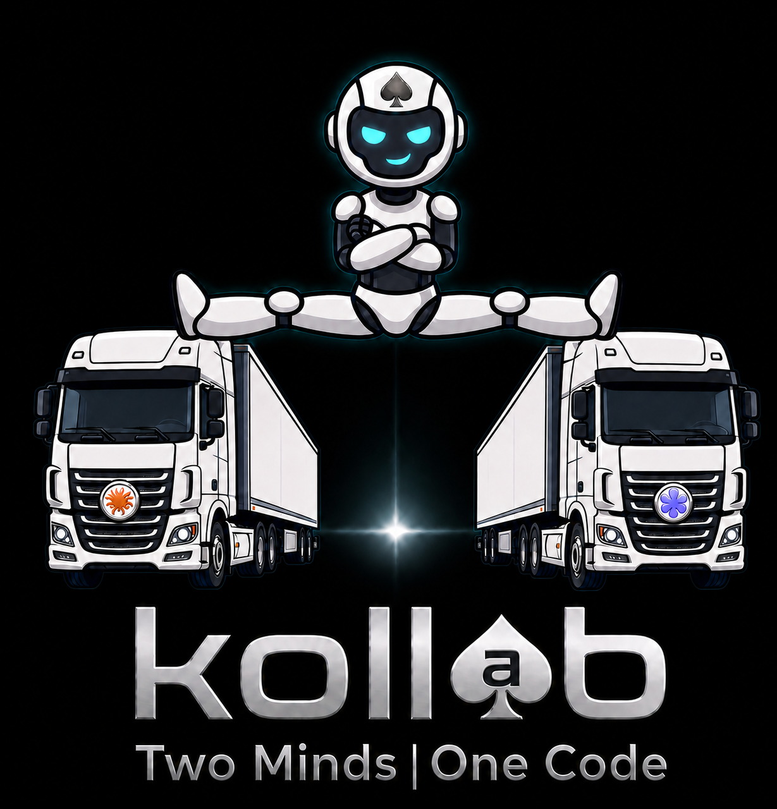

<p align="center">
  
</p>

<p align="center"><em>Two Minds | One Code</em></p>

# koll♠b

koll♠b is a transparent, adversarial-collaborative dialogue between Claude Code and OpenAI Codex — powered by ACE 🤖, the Adversarial Collab Engine.

You give koll♠b a goal. Claude produces. Codex critiques. Claude defends or revises. Repeat until they agree, or until they hit a round limit. Every turn is rendered in a chat-style browser UI so you can see exactly how each model receives criticism, pushes back, concedes, or revises. You can interrupt, inject directed instructions, or halt at any time.

This is a demo project. The point is the visibility into the inter-model dynamic, not the orchestration itself.

> ⚠️ Early-stage. APIs, UI, and behavior will change. Not for production use.

---

## What it actually does

- Runs **Claude Code** (the CLI agent harness) and **OpenAI Codex** as two long-lived peer agents
- Sends the user's goal to both **in parallel** at session start so each forms its own first-hand understanding
- Drives a turn-based loop: producer (Claude) → critic (Codex) → producer → critic, with each turn ending in a structured `<verdict>AGREE | DISAGREE | REVISED</verdict>` trailer
- Renders the full dialogue live in a browser UI with response IDs (`C-1`, `X-2`, …), color-coded turn cards, and collapsible reasoning blocks
- Supports multiple concurrent tabs — each tab is an independent session
- Maintains a history pane of all completed sessions with one-click readonly replay
- Logs every event as JSONL on disk

## What it is not

- Not a multi-agent framework, CI tool, or code-review platform
- Not a wrapper around the Claude API or the Claude desktop/web app — it specifically drives **Claude Code**
- Not a replacement for [`codex-plugin-cc`](https://github.com/openai/codex-plugin-cc), which solves a related but different problem

---

## Install

### Prerequisites

- Python 3.11+
- [Claude Code](https://docs.claude.com/en/docs/claude-code) installed and authenticated (`claude --version` works)
- [OpenAI Codex CLI](https://github.com/openai/codex) installed and authenticated (`codex --version` works)

### From source

```bash
git clone <repo-url> kollab
cd kollab
pip install -e .
```

### Via Docker

```bash
docker build -t kollab .
docker run --rm -p 8765:8765 \
  -v ~/.kollab:/root/.kollab \
  -v ~/.claude:/root/.claude \
  -v ~/.codex:/root/.codex \
  kollab
```

The mounts pass through your existing Claude Code and Codex CLI auth so you don't have to sign in again inside the container.

---

## Run

```bash
kollab
```

This starts the local server and opens `http://localhost:8765` in your default browser.

On first run, the **Configure** modal will appear. Set:

- Path to the `claude` and `codex` binaries (auto-detected if on `PATH`)
- Model preferences for each
- Round limit, working directories

Save, then click **+ New Session** and type your goal.

---

## Usage

**Start a session** — click **+ New Session**, type your goal, optionally override the round limit or per-session token budget, then hit Start. The goal is sent to both agents in parallel and their first turns stream in live.

**Interrupt** — click **Stop** at any time. The current turn is cancelled cleanly. When halted, select a target agent (`Claude`, `Codex`, or `Claude, Codex`) before the input box enables, then type your instruction and click **Send**. Click **Resume** to continue.

**Directed input** — when a session is halted, you must select a target before the input box enables. The target is required — there is no free-form `@agent` syntax. Your message is injected only into the targeted agent's next turn and rendered as `USER → CLAUDE`, `USER → CODEX`, or `USER → CLAUDE, CODEX`.

**Reference a prior turn** — include `C-3` or `X-2` in your message. ACE routes it to the cited agent with the referenced turn as quoted context. Example: *"X-2 was wrong about latency — Claude, push back."*

**Multiple sessions** — open multiple tabs, each running an independent session. Switch between them freely. The input strip always operates on the active tab.

**History pane** — click **≡** to toggle the history pane. Completed sessions appear there with goal preview, timestamp, and end-reason pill (converged / round limit / halted). Click any row to open a readonly replay tab.

**Readonly replay** — reconstructs all turn cards from the JSONL log. Visually identical to a live session. Input strip is disabled.

**Configure** — click **⚙** at any time.

**Quit** — click **Quit** in the top bar to cleanly shut down the server and close the browser tab.

**Logs** — all session events are written as JSONL to `~/.kollab/sessions/<session-id>.jsonl`. Inspect with `jq`.

---

## What koll♠b is for

- Watching how two frontier models actually negotiate disagreement
- Demonstrating that cross-vendor agent collaboration is possible and legible
- Studying where each model concedes, where each digs in, where they converge
- Building intuition about which model is the better critic, the better producer, on which kinds of tasks

If you want a production multi-agent orchestrator, look at Conductor, Claude Squad, or Claude Code's built-in Agent Teams.

---

## Configuration

Config lives at `~/.kollab/config.toml`. The Configure modal in the UI is the recommended way to edit it; direct file edits work too.

Defaults:

```toml
[claude]
binary = "claude"
model = "sonnet"
workdir = "~/.kollab/workspace/claude"

[codex]
binary = "codex"
model = "gpt-5.4"
workdir = "~/.kollab/workspace/codex"

[session]
round_limit = 8
sessions_dir = "~/.kollab/sessions"

[server]
port = 8765
```

Per-session overrides (round limit, token budget, model) can be set in the New Session modal without touching the config file.

---

## Architecture

```
┌──────────────────────────────────────────────────────┐
│  Browser (tabbed chat UI + history pane)             │
│   ↕ WebSocket                                        │
│  FastAPI server                                      │
│   ↕                                                  │
│  ACE — Adversarial Collab Engine (ace.py)            │
│   ├── Claude agent (Claude Agent SDK, persistent)    │
│   └── Codex agent (codex CLI subprocess, persistent) │
└──────────────────────────────────────────────────────┘
         │
         ▼
   ~/.kollab/sessions/*.jsonl  (event log)
```

Single Python process. WebSocket for live events. No database — JSONL on disk is sufficient.

---

## Development

```bash
# install in dev mode
pip install -e ".[dev]"

# run tests
pytest

# run with hot reload
uvicorn kollab.server:app --reload --port 8765
```

---

## License

TBD.

## Status

v2 in smoke testing. v1 MVP complete.
