# koll♠b

koll♠b is a transparent multi-agent orchestration system that runs two AI coding agents — **Claude** (Anthropic) and **Codex** (OpenAI) — through an adversarial-collaborative reasoning workflow on a shared engineering objective.

Every turn, every critique, every revision, and every disagreement is rendered live in a browser UI as it happens. The product is **visibility into the inter-model dynamic** — not the orchestration itself.

> Early-stage demo. Not for production use.

---

## Why koll♠b exists

Most AI-assisted engineering workflows are single-model and opaque: you send a prompt, you get output, you don't know what tradeoffs were made or what the model didn't challenge itself on.

koll♠b makes the reasoning process inspectable. Two independent models work toward the same goal with fixed roles — one produces, one adversarially critiques — and neither can skip the other's objections. Every turn is logged, streamed live, and replayable. You can stop the session at any point, inject a directive into one or both agents, and resume. The dialogue is the artifact.

---

## Why not just use agents?

Agents can emit chain-of-thought logs. The distinction isn't observability capability — it's whether observability is the contract or the configuration.

With autonomous agent frameworks, coordination is implicit (one agent calls another), convergence is emergent (you hope they agree), and human intervention is a kill switch bolted on after the fact.

koll♠b is different in three specific ways:

- **Structured convergence protocol.** Every turn ends with a `<verdict>` trailer — `AGREE`, `DISAGREE`, or `REVISED`. ACE parses this mechanically. Codex AGREE is the sole convergence signal; Claude AGREE has no effect on session state. The critic is the convergence arbiter, not a heuristic.
- **Human intervention is first-class.** Stop can fire at any point including mid-stream. The partial output is preserved as an observable artifact but never fed back into any agent's prompt. Directive injection is per-actor and queued — multiple directives accumulate, not overwrite. This is a state machine design, not a kill switch.
- **Observability is structural, not opt-in.** Turn IDs are stable for the session lifetime. Reasoning blocks are separated from response text. Interrupted turns keep their ID and remain visible. Every event is typed, logged to JSONL, and replayable from disk. You can't accidentally make a session un-auditable.

The framing: **agents can be made observable — koll♠b makes observability the contract, not the configuration.**

---

## ACE — Adversarial Collab Engine

ACE (`ace.py`) is the orchestration control plane. It owns the session state machine, drives every turn, parses verdict trailers, enforces convergence rules, and manages halt/resume lifecycle. ACE doesn't understand what the models are saying — it reads the `<verdict>` tag at the end of each turn and acts on it mechanically.

This maps directly to known platform patterns: ACE is a **reconciliation loop**. Desired state = convergence. Actual state = current verdict and round count. ACE continuously drives toward the desired state by sequencing turns, enforcing role boundaries, and parsing structured signals — the same control plane model as a Kubernetes controller, a GitOps engine, or a workflow orchestrator.

**Session state machine:**

```
idle → fanning_out → claude_turn ⇄ codex_turn → done
                          ↕
                        halted → (resume) → claude_turn | codex_turn
                          ↓
                       expired
```

**Roles are fixed per session:**

- **Claude — Producer.** Writes the initial proposal and defends or revises it under critique. Claude's first turn is always `PROPOSAL` — no verdict on C-1.
- **Codex — Critic.** Adversarially reviews Claude's output, finds substantive flaws, and issues a verdict each turn. A single Codex `AGREE` closes the session — no second confirmation needed.

**Verdict protocol:**

| Verdict | Meaning |
|---|---|
| `AGREE` | Critique accepted / issue resolved — session ends (Codex only) |
| `DISAGREE` | Position held, critique rejected — loop continues |
| `REVISED` | Work updated in response to critique — loop continues |

**Arbitration semantics:** ACE arbitrates on process, not content. Neither agent can skip a turn, respond twice, or see the other's system prompt. Neither agent sees the full transcript — each sees only the peer's last completed turn. The user cannot inject content during an active turn. This is bounded autonomy: agents reason freely within their turns; ACE enforces the structure around them.

Full orchestration spec: [`specs/ace-orchestration.md`](specs/ace-orchestration.md)

---

## Architecture



**Five layers:**

- **Browser UI** — vanilla HTML + Tailwind CDN + `app.js`. Tabbed session view, streaming turn cards, history pane, directive input, export. No framework, no build step.
- **FastAPI server** (`server.py`) — HTTP + WebSocket. Single global `/ws` endpoint broadcasts all session events to all connected clients. Session history, config, and export endpoints.
- **ACE** (`ace.py`) — session state machine, turn dispatcher, verdict parser, directive queue (`dict[actor → list[str]]`), halt controller with configurable timeout, prompt builder backed by `prompts.py`.
- **Agents** — `claude_agent.py` wraps the Claude Agent SDK (`ClaudeSDKClient`) for persistent in-process sessions with filesystem MCP. `codex_agent.py` drives the `codex exec` CLI as a subprocess with session resume via thread ID. Both implement `interrupt()` without tearing down the session.
- **Persistence** — append-only JSONL event log per session (`transcript.py`), TOML config (`config.py`), optional file log (`~/.kollab/kollab.log`).

**Session lifecycle:**



**Key design decisions:**

- **Persistent agent sessions** — both agents hold context across the full run. ACE passes only the peer's latest message, not a full transcript replay.
- **Goal fan-out** — the user's goal is sent to both agents in parallel at session start, so each forms a first-hand understanding before any peer output exists.
- **Mid-stream halt** — `interrupt()` is called on the active agent; ACE continues consuming chunks until the pipe drains naturally (no teardown). The interrupted turn stays visible in the UI but is never fed back into any agent's prompt.
- **Directive queue** — multiple directives sent while halted accumulate per actor. On resume, all queued directives for the active agent are concatenated into the next turn's prompt prefix.
- **No database** — JSONL on disk. Every event (turn start, turn end, verdict, user input, interrupt, session end) is one line of JSON, append-only, flush on every write.

---

## Inspectability

koll♠b is built around the premise that AI-assisted engineering workflows should be auditable. Every decision point in the orchestration is observable:

- Turn IDs (`C-1`, `X-1`, ...) are stable for the session lifetime — interrupted turns keep their ID, completed turns never renumber.
- Reasoning blocks are surfaced per turn alongside the response text.
- Directives are rendered as explicit `DIRECTIVE → CLAUDE / CODEX` cards, not silently injected.
- Interrupted turns are preserved as observable artifacts with a `⏸ interrupted` marker — the partial output is visible but clearly not part of the dialogue.
- Every session is replayable from its JSONL log — the history pane reconstructs the full turn sequence from disk.
- Export produces a full-fidelity markdown transcript including reasoning blocks, verdicts, thread IDs, and directives.

---

## API and webhooks *(in progress)*

A REST API and webhook layer is under active development. When complete, koll♠b will support headless session control — trigger sessions programmatically, poll state, and retrieve transcripts. A webhook layer will emit structured events (`disagreement`, `convergence`, `halt`, `directive`, and others) to any HTTP endpoint, with Slack incoming webhooks as a first-class target.

This will enable integration patterns like Slack channel notifications, GitHub Actions adversarial PR review, and CI pipeline convergence gates.

Full design spec: [`specs/ace-api-webhooks.md`](specs/ace-api-webhooks.md)

---

## Quick start

```bash
git clone https://github.com/klokworkai/kollab
cd kollab
pip install -e .
kollab
```

Opens `http://localhost:8765`. On first run, configure binary paths via **⚙ Configure** in the top bar.

For full setup instructions including Docker, CLI auth, troubleshooting, and session walkthrough: **[RUNBOOK.md](RUNBOOK.md)**

---

## Configuration

Config lives at `~/.kollab/config.toml`. The **⚙ Configure** modal is the recommended way to edit it.

| Field | Default | Description |
|---|---|---|
| `claude_binary` | `claude` | Path to Claude Code CLI |
| `claude_model` | `claude-sonnet-4-6` | Default Claude model. Short aliases (`haiku`, `sonnet`, `opus`) are also accepted and resolved to full model strings at runtime. |
| `codex_binary` | `codex` | Path to Codex CLI |
| `codex_model` | `gpt-5.4` | Default Codex model. Short alias `mini` resolves to `gpt-5.4-mini`. |
| `round_limit` | `8` | Max rounds per session |
| `halt_timeout_secs` | `1800` | Auto-expire halted sessions (0 = never) |
| `port` | `8765` | Server port |
| `mcp_filesystem_enabled` | `true` | Give Claude filesystem MCP access |
| `logging_enabled` | `false` | Write logs to `~/.kollab/kollab.log` |

Per-session overrides (model, round limit, token budget) are set in the New Session modal.

---

## Development

```bash
pip install -e ".[dev]"
pytest
uvicorn kollab.server:app --reload --port 8765
```

---

## Specs

| Document | Contents |
|---|---|
| [`specs/ace-orchestration.md`](specs/ace-orchestration.md) | ACE state machine, turn lifecycle, verdict protocol, arbitration semantics, observability model |
| [`specs/ace-api-webhooks.md`](specs/ace-api-webhooks.md) | REST API, webhook events and payloads, Slack and GitHub integration patterns |

---

## Status

v2 — active development. Core dialogue loop, halt/resume, directive injection, history, streaming, export, and readonly replay are complete.

**In progress:** REST API, webhook emission, and all programmatic/headless integration patterns. GitHub MCP integration and Slack/GitHub adapters are planned.

---

## License

Apache 2.0

---

<p align="center">
  
</p>

