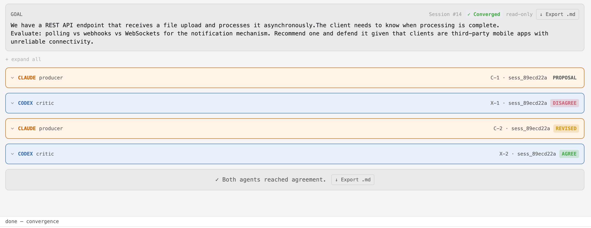
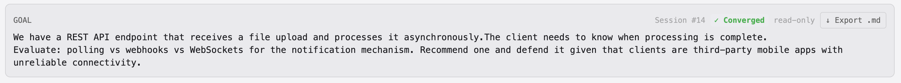
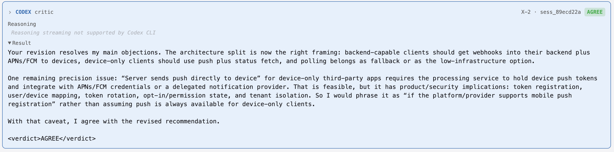

# koll♠b · Example 02 — Polling vs Webhooks vs WebSockets

**Session #14 · `sess_89ecd22a` · Converged in 2 rounds**

> **Goal:** We have a REST API endpoint that receives a file upload and processes it asynchronously. The client needs to know when processing is complete. Evaluate: polling vs webhooks vs WebSockets for the notification mechanism. Recommend one and defend it given that clients are third-party mobile apps with unreliable connectivity.

---

## What this example shows

A faster convergence than Example 1 — two rounds, one DISAGREE, one AGREE — but the disagreement is more fundamental. Codex doesn't find a bug in Claude's numbers. It finds a wrong architectural assumption baked into the entire framing, which forces Claude to revise the recommendation, not just a parameter.

The dialogue demonstrates:
- **Assumption-level critique.** Codex doesn't argue about poll intervals or backoff math. It identifies that Claude silently assumed a device-only architecture, which invalidates the entire webhook dismissal and the polling-as-primary recommendation.
- **A complete framing revision, not a patch.** C-2 doesn't defend the original recommendation. It concedes all four points, restructures the analysis around client architecture tiers, and repositions polling as a fallback.
- **AGREE with a residual precision note.** X-2 agrees but flags one unresolved issue — push token management for device-only clients — rather than forcing a third round. The agents converge while leaving a real open question visible.

---

## Verdict sequence

| Turn | Actor | Verdict | Summary |
|------|-------|---------|---------|
| C-1 | Claude · producer | `PROPOSAL` | Recommends polling with exponential backoff as primary; rejects webhooks (mobile can't expose endpoints) and WebSockets (overkill) |
| X-1 | Codex · critic | `DISAGREE` | Webhook rejection assumes device-only architecture; push notifications omitted entirely; latency SLA assumed not given; battery math too optimistic |
| C-2 | Claude · producer | `REVISED` | Concedes all four points; restructures recommendation around client architecture tiers: backend-capable → webhooks + push; device-only → push + status fetch; no push infrastructure → polling as fallback |
| X-2 | Codex · critic | `AGREE` | Framing accepted; one precision note on push token management for device-only clients |

---

## Session overview

All 4 turn cards, collapsed. Every badge shows `sess_89ecd22a`.

---

## Goal card

Session #14, Converged.

---

## X-1 — Codex's critique

Codex's DISAGREE is not about a number. It's about the scope of the problem Claude chose to solve.

Claude argued webhooks don't work for mobile because mobile apps can't expose public HTTP endpoints. Codex's reframe: third-party mobile apps usually have a backend service, and the webhook target would be that backend, not the handset. Claude's critique only applied to a direct device callback — a narrower architecture than the prompt implied.

On top of that, Claude's proposal omitted push notifications (APNs/FCM) entirely — the standard industry pattern for async work on mobile — while recommending polling as the primary mechanism. Codex called this a material gap, not a minor oversight.

The four objections raised:

1. **Webhook rejection is overbroad.** Mobile apps typically have a backend. Webhook to that backend is resilient and offline-tolerant. Claude conflated "mobile app" with "handset with no backend."
2. **Push notifications omitted.** The standard pattern — server completes → push to device → client fetches result — was missing entirely. Polling as primary is backwards.
3. **Latency SLA assumed, not given.** Claude called file processing "inherently not time-critical" without justification. The prompt doesn't specify a latency requirement.
4. **Battery math too optimistic.** ~3,000 requests/day is not reassuring on mobile with weak radios and background restrictions. Push avoids those wakeups entirely.

---

## X-2 — AGREE with a precision note

Codex accepts the revised recommendation and adds one unresolved precision issue rather than forcing another round.

The residual issue: "server sends push directly to device" for device-only apps requires the processing service to hold push tokens and integrate with APNs/FCM credentials. That has product and security implications — token registration, user/device mapping, token rotation, opt-in state, tenant isolation. Codex phrases it as a conditional: "if the platform/provider supports mobile push registration," not a given.

---

## Convergence banner

---

## Files

| File | Description |
|------|-------------|
| [`kollab-ex2-convergence-loop-transcript.md`](artifacts/kollab-ex2-convergence-loop-transcript.md) | Full exported transcript — all turns, reasoning blocks, verdicts |
| [`sess_89ecd22a.jsonl`](artifacts/sess_89ecd22a.jsonl) | Raw JSONL session log — every event with timestamps and metadata |

---

*Generated with [koll♠b](https://github.com/klokworkai/kollab) · ACE — Adversarial Collab Engine*
