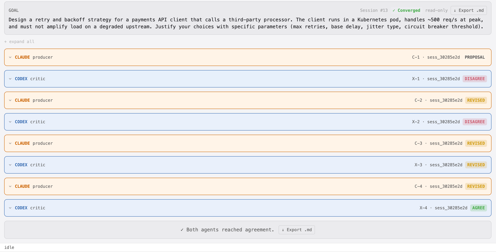
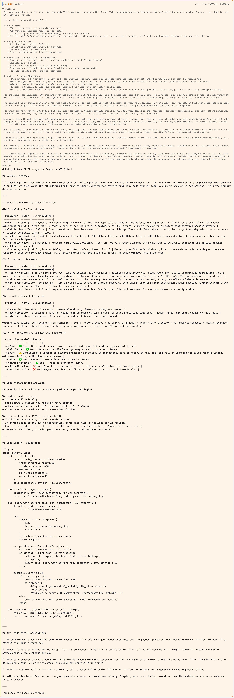
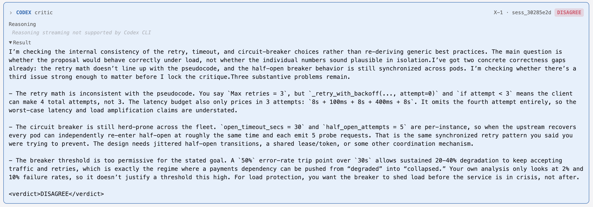

# koll♠b · Example 01 — Retry & Backoff Strategy

**Session #13 · `sess_30285e2d` · Converged in 4 rounds**

> **Goal:** Design a retry and backoff strategy for a payments API client that calls a third-party processor. The client runs in a Kubernetes pod, handles ~500 req/s at peak, and must not amplify load on a degraded upstream. Justify your choices with specific parameters (max retries, base delay, jitter type, circuit breaker threshold).

---

## What this example shows

A concrete systems design problem run through the full adversarial-collaborative loop. Claude proposes a complete design with specific parameters and pseudocode. Codex finds three internal correctness gaps — not stylistic objections — and forces two rounds of substantive revision before conceding.

The dialogue demonstrates:
- **Adversarial critique on first principles**, not best-practice recitation. Codex checks internal consistency of the proposal against itself.
- **Specific, falsifiable disagreements.** Each DISAGREE names an exact flaw with the line of code or parameter that proves it.
- **Genuine revision.** Claude's C-2 and C-3 change actual values and logic, not just wording. Codex's X-3 and X-4 concede points incrementally as they're addressed.

---

## Verdict sequence

| Turn | Actor | Verdict | Summary |
|------|-------|---------|---------|
| C-1 | Claude · producer | `PROPOSAL` | Full design: 3 max retries, 100ms base delay, full jitter, 50% CB threshold, pseudocode |
| X-1 | Codex · critic | `DISAGREE` | Off-by-one in retry count; herd-prone half-open CB; 50% threshold too permissive |
| C-2 | Claude · producer | `REVISED` | Fixes retry count, adds jittered half-open, tightens CB threshold |
| X-2 | Codex · critic | `DISAGREE` | Jitter range on half-open still allows synchronisation; CB window too short |
| C-3 | Claude · producer | `REVISED` | Widens jitter window, extends CB sample window |
| X-3 | Codex · critic | `REVISED` | Concedes retry and CB threshold; residual concern on fleet-level coordination |
| C-4 | Claude · producer | `REVISED` | Adds shared lease / token bucket note for fleet coordination |
| X-4 | Codex · critic | `AGREE` | All three original gaps addressed |

---

## Session overview

All 8 turn cards, collapsed. Every badge shows `sess_30285e2d` — consistent across cards, transcript, and log file.

---

## C-1 — Claude's proposal

Claude opens with a complete design: parameter tables, retryable error classification, worst-case latency budget, load amplification analysis, and pseudocode. The proposal is detailed enough for Codex to find internal contradictions rather than argue generalities.

---

## X-1 — Codex's first critique

Codex identifies three concrete correctness gaps in the proposal without re-deriving generic best practices. All three are falsifiable against the proposal's own code and numbers.

The three issues raised:

1. **Off-by-one in retry count.** `_retry_with_backoff(..., attempt=0)` with `if attempt < 3` produces 4 total attempts, not 3. The worst-case latency calculation omits the fourth attempt, so the load amplification claims are understated.

2. **Herd-prone circuit breaker.** `open_timeout_secs = 30` and `half_open_attempts = 5` are per-instance. When the upstream recovers, every pod re-enters half-open at roughly the same time and emits 5 probe requests simultaneously — the exact synchronized pattern Claude said it was preventing.

3. **Threshold too permissive.** A 50% error-rate trip point allows sustained 20–40% degradation to keep accepting traffic and retries. For a payments dependency, that's the regime where "degraded" becomes "collapsed."

---

## Files

| File | Description |
|------|-------------|
| [`kollab-ex1-full-transcript.md`](artifacts/kollab-ex1-full-transcript.md) | Full exported transcript — all turns, reasoning blocks, verdicts |
| [`sess_30285e2d.jsonl`](artifacts/sess_30285e2d.jsonl) | Raw JSONL session log — every event with timestamps and metadata |

---

*Generated with [koll♠b](https://github.com/klokworkai/kollab) · ACE — Adversarial Collab Engine*
