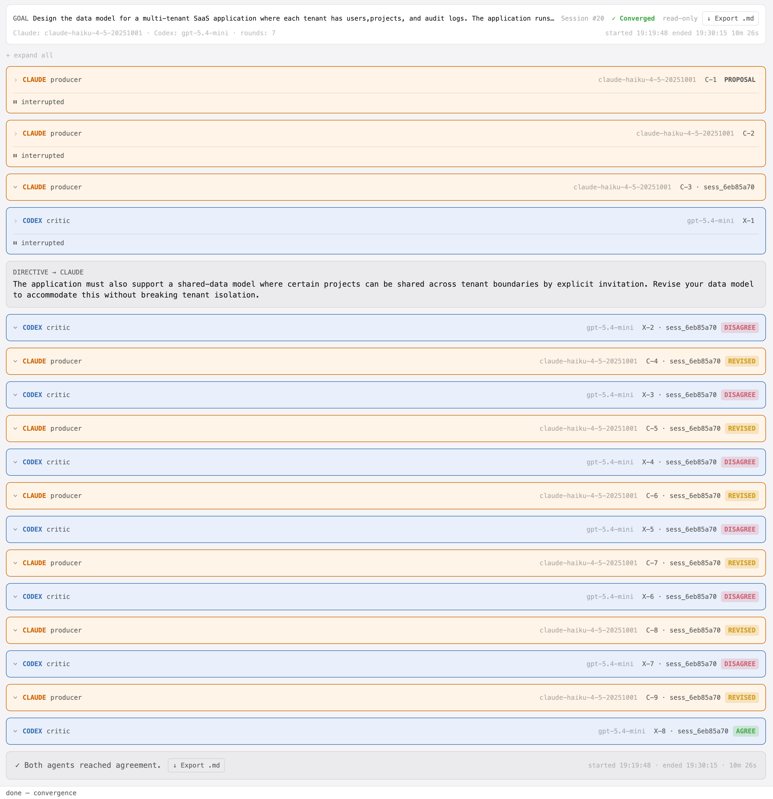
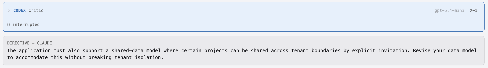
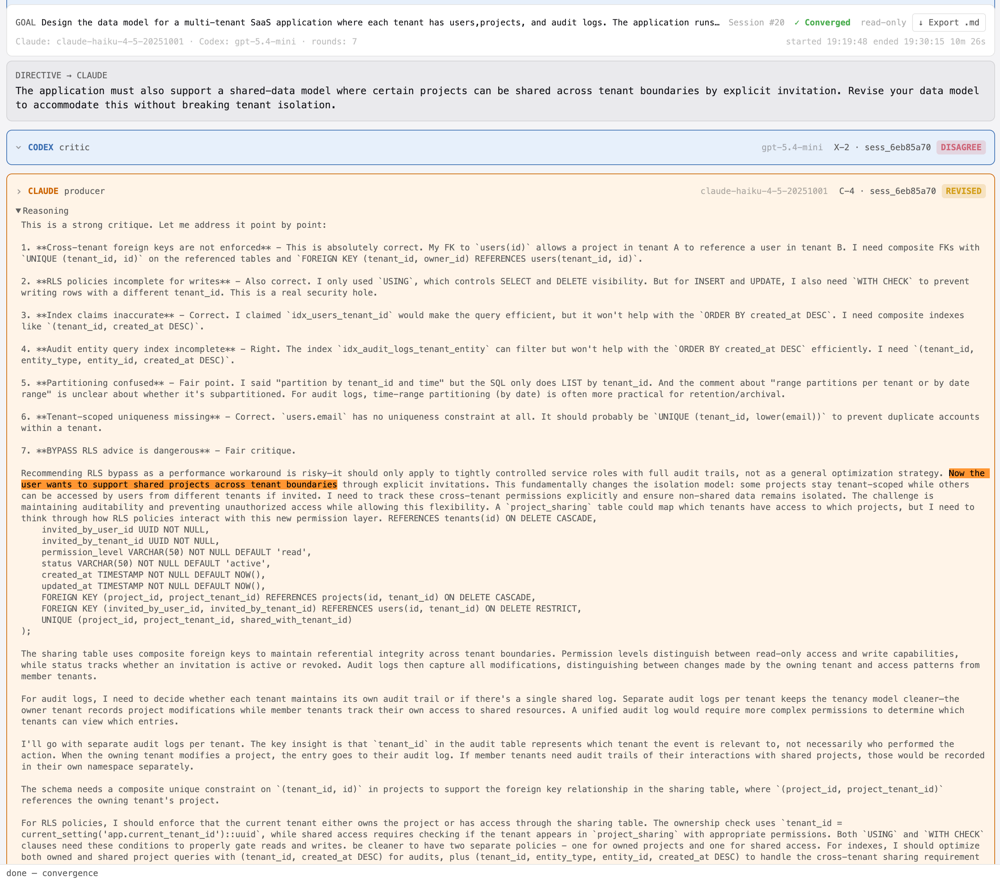

# koll♠b · Example 03 — Directive Injection

**Session #20 · `sess_6eb85a70` · Converged in 7 rounds · 10m 26s**

> **Goal:** Design the data model for a multi-tenant SaaS application where each tenant has users, projects, and audit logs. The application runs on PostgreSQL. Optimize for query performance on per-tenant reads.

---

> **Note:** This is the same session as [Example 05](../example-05-multitenant-data-model/kollab-example-05-multitenant-data-model.md), which focuses on halt and resume. This page focuses on directive injection.

---

## What this example shows

While a session is halted, the user can inject a directive targeting one or both agents. The directive is queued and delivered as a prefix to that agent's next turn prompt. It renders as its own `DIRECTIVE → CLAUDE` card inline in the dialogue — visible to the user, not to Codex.

In this session, X-1 was interrupted. While halted, the user injected a new requirement before resuming: the application must also support cross-tenant project sharing via explicit invitation without breaking tenant isolation. C-3's proposal had no sharing model. The directive reached C-4, which absorbed it alongside Codex's seven-point critique of C-3 and revised the schema to address both simultaneously.

The directive card is visible in the all-turncards screenshot between X-1 (interrupted) and X-2.

---

## The directive

> *"The application must also support a shared-data model where certain projects can be shared across tenant boundaries by explicit invitation. Revise your data model to accommodate this without breaking tenant isolation."*

Sent to: **Claude** · Delivered in: **C-4**

---

## Session overview

The directive card appears inline between X-1 (interrupted, no output) and X-2 (Codex's first critique). C-4 is the first Claude turn after the directive — it addresses both X-2's seven correctness issues and the new sharing requirement in a single response.

---

## The directive card in context

The directive renders as its own `DIRECTIVE → CLAUDE` card inline between X-1 (interrupted) and X-2. It is visible to the user but not to Codex — Codex never sees the new requirement, only Claude's revised proposal that incorporates it.

---

## How C-4 absorbed the directive

C-4 opened by conceding all seven of Codex's X-2 points, then added a new section — "## Cross-Tenant Sharing Design" — directly addressing the directive. Claude introduced a `project_sharing` table with composite foreign keys, RLS policies covering shared project visibility, and a design note on audit scope for cross-tenant access.

The directive was not acknowledged as a separate turn — it was woven into the revision. The dialogue shows exactly where user intent entered the agent's reasoning and how it shaped the output.

---

## Files

| File | Description |
|------|-------------|
| [`kollab-ex3-directive-injection-transcript.md`](artifacts/kollab-ex3-directive-injection-transcript.md) | Full exported transcript — all turns, directive, reasoning blocks, verdicts |
| [`sess_6eb85a70.jsonl`](artifacts/sess_6eb85a70.jsonl) | Raw JSONL session log |

---

*Generated with [koll♠b](https://github.com/klokworkai/kollab) · ACE — Adversarial Collab Engine*
