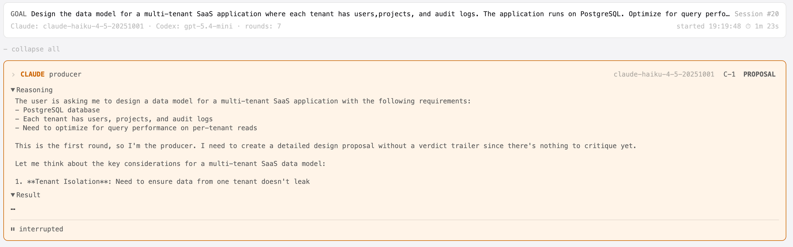
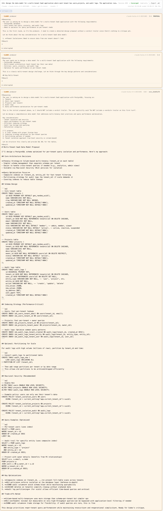

# koll♠b · Example 05 — Halt and Resume

**Session #20 · `sess_6eb85a70` · Converged in 7 rounds · 10m 26s**

> **Goal:** Design the data model for a multi-tenant SaaS application where each tenant has users, projects, and audit logs. The application runs on PostgreSQL. Optimize for query performance on per-tenant reads.

---

> **Session lineage:** This example shares the same orchestration session (`sess_6eb85a70`) as [Example 03 — Directive Injection](../directive-injection/kollab-example-03-multitenant-data-model.md). Both pages are lenses on the same live run — same agents, same goal, same JSONL log. This page focuses on the mid-stream halt that triggered a user intervention; Example 03 focuses on the directive that followed. The shared session is intentional: it demonstrates how koll♠b maintains collaborative trace continuity across halt, resume, and directive injection within a single workflow.

---

## What this example shows

A session can be halted at any point — including mid-stream while an agent is generating output. The interrupted turn is preserved as an observable artifact with whatever reasoning and output had accumulated at the moment of interruption. It is never fed back into any agent's prompt. On resume, the same agent runs again from clean history.

In this session, Claude was interrupted twice (C-1, C-2) before producing any result output, and Codex was interrupted once (X-1). All three interrupted turns are visible in the dialogue with their partial reasoning exposed. C-3 is the first complete turn — Claude running fresh after two halts, picking up from the goal as if the interrupted turns never happened.

---

## C-1 and C-2 — interrupted mid-reasoning

Both turns were stopped before any result was produced. The reasoning blocks show Claude had started thinking through tenant isolation requirements in C-1 and multi-tenant design patterns in C-2. Neither turn was fed back into any agent.

The cards are marked `⏸ interrupted` with no verdict pill. Turn IDs are stable — C-3 is the third Claude turn, not a renumbered first.

---

## C-3 — clean resume after two halts

C-3 ran cleanly after the session was resumed. The prompt was rebuilt from clean history (interrupted turns filtered out) with a notice to disregard whatever was in flight. Claude produced a full proposal — schema, indexes, RLS, partitioning — with no visible trace of the two prior interruptions.

---

## What the interrupted turns show

The reasoning in C-1 and C-2 is the honest record of what the model was thinking when stopped. It is not fed forward, not summarised, not used — it exists only for the user to see. This is the intended behaviour: interrupted turns are observable artifacts, not inputs to the dialogue.

---

## Files

| File | Description |
|------|-------------|
| [`kollab-ex5-mid-halt-session-transcript.md`](artifacts/kollab-ex5-mid-halt-session-transcript.md) | Full exported transcript — all turns, interrupted artifacts, reasoning blocks, verdicts |
| [`sess_6eb85a70.jsonl`](artifacts/sess_6eb85a70.jsonl) | Raw JSONL session log |

---

*Generated with [koll♠b](https://github.com/klokworkai/kollab) · ACE — Adversarial Collab Engine*
