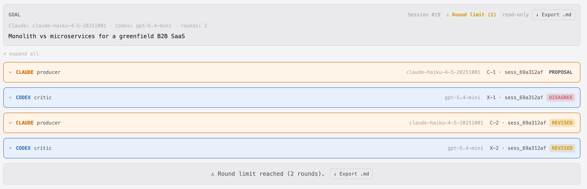
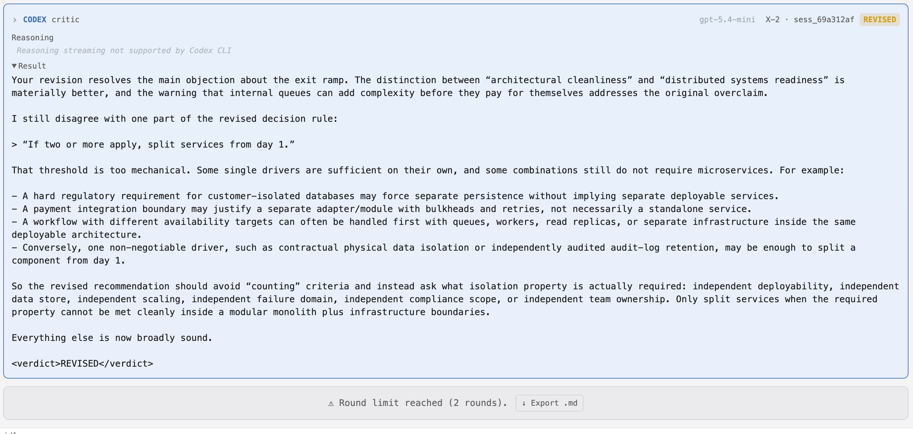
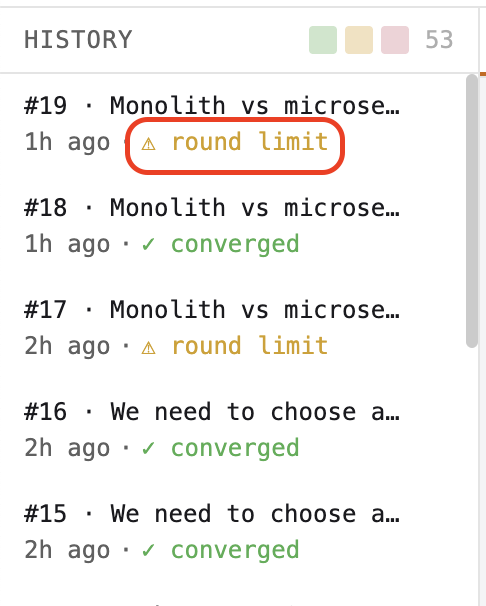

# koll♠b · Example 04 — Monolith vs Microservices

**Session #19 · `sess_69a312af` · Round limit reached (2 rounds)**

> **Goal:** Monolith vs microservices for a greenfield B2B SaaS

---

## What this example shows

Round limit as a deliberate session outcome, not a failure mode. The session ends with both agents still in productive disagreement — Codex issued REVISED on its final turn, not AGREE. The debate wasn't resolved; it was cut off.

This is the intended use case for a short round limit: force a time-boxed design review where the agents surface the key fault lines without running to full convergence. What you get is a map of the unresolved disagreements, not a final answer.

The dialogue demonstrates:
- **Disagreement that moves the argument forward without resolving it.** X-1 finds two real flaws in C-1. C-2 concedes both and revises. X-2 accepts the revision but finds a new flaw in the revised decision rule. Round limit fires before C-3 can respond. The argument improved across every turn but never closed.
- **The "exit ramp" fallacy called out explicitly.** Claude's C-1 claims that adding internal queues to a monolith makes future service extraction "mechanical." Codex correctly identifies this as conflating architectural cleanliness with distributed systems readiness — two separate problems.
- **A mechanical decision rule replaced with a properties-based one.** Claude's C-2 introduces a threshold rule ("if two or more criteria apply, split services from day 1"). Codex's X-2 rejects it as too coarse and proposes a better frame: ask what isolation property is actually required, and only split when that property cannot be met inside a modular monolith.

---

## Verdict sequence

| Turn | Actor | Verdict | Summary |
|------|-------|---------|---------|
| C-1 | Claude · producer | `PROPOSAL` | Recommends modular monolith with an "exit ramp" via internal events and queues; lists three exceptions for microservices from day 1 |
| X-1 | Codex · critic | `DISAGREE` | Exit ramp is oversold — internal queues don't solve transaction boundaries, idempotency, or saga orchestration; exceptions list misses B2B-specific drivers (compliance, tenant isolation, availability asymmetry) |
| C-2 | Claude · producer | `REVISED` | Concedes both points; reframes exit ramp as 30–40% of the migration work, not a straight path; adds four B2B-specific decision criteria; proposes a "two or more apply" threshold rule |
| X-2 | Codex · critic | `REVISED` | Accepts the exit ramp correction; rejects the threshold rule as too mechanical; proposes properties-based decision frame instead |
| — | — | `round limit` | Session ends at 2 rounds — C-3 never runs |

---

## Session overview

All 4 turn cards. Goal card shows models (`claude-haiku-4-5-20251001 · gpt-5.4-mini`) and round limit (`rounds: 2`). Status shows `⚠ Round limit (2)`.

---

## X-2 — Codex's final turn (REVISED)

Codex accepts the main revision but finds a residual flaw in the updated decision rule. The session ends here — Claude never gets to respond.

The residual issue: Claude's revised rule says "if two or more criteria apply, split services from day 1." Codex argues this is wrong in both directions — some single drivers (contractual physical data isolation, independently audited audit logs) are sufficient on their own; some combinations still don't require microservices because the required isolation property can be met with infrastructure boundaries inside a monolith. The better frame: identify what isolation property is actually needed (independent deployability, data store, scaling, failure domain, compliance scope, team ownership) and only split when the monolith genuinely can't provide it.

---

## Round limit banner

---

## History pane

The history pane shows the round limit pill in amber alongside converged sessions in green — making the outcome immediately distinguishable at a glance.

---

## Files

| File | Description |
|------|-------------|
| [`kollab-ex4-full-transcript.md`](artifacts/kollab-ex4-full-transcript.md) | Full exported transcript — all turns, reasoning blocks, verdicts |
| [`sess_69a312af.jsonl`](artifacts/sess_69a312af.jsonl) | Raw JSONL session log — every event with timestamps and metadata |

---

*Generated with [koll♠b](https://github.com/klokworkai/kollab) · ACE — Adversarial Collab Engine*
